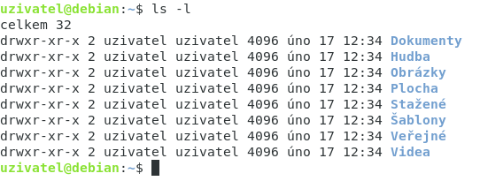
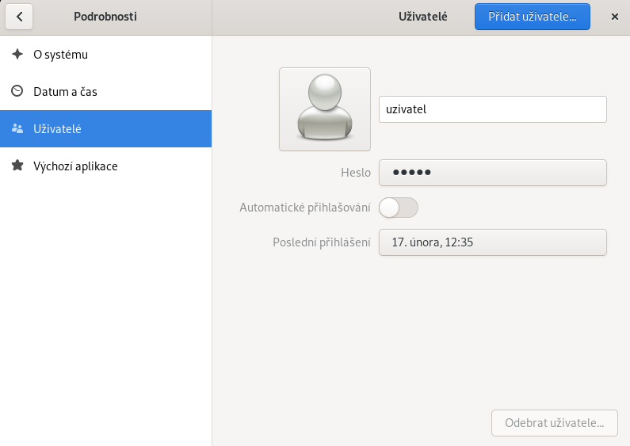
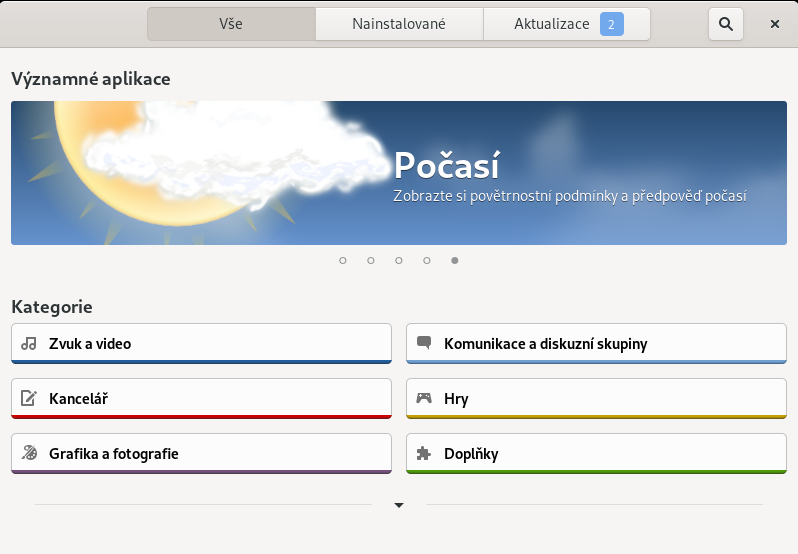

# Základní příkazy

Příkazy:
* **ls** -> Výpis adresářů
    * **-l** -> Podrobnější výpis
    * **-a** -> Zobrazí i skryté soubory
* **su** -> Substitute User, přepnutí na jiného uživatele, bez zadání loginu -> přihlášení jako *root*
* **sudo** -> Provede příkaz jako *root*

&nbsp;

# Uživatelská práva

Práva uživatelů a skupin jsou vypsané ve výpisu adresářů -> *ls -l*

Např.:
>drwxr-x--x

* **d** -> directory
* **r** -> read
* **w** -> write
* **x** -> execute

Rozdělením získáme trojice:

>d/rwx/r-x/--x

První trojice -> uživatel

Druhá trojice -> skupina

Třetí trojice -> ostatní

## Změna práv

Příkazy:

* **chmod** -> Příkaz pro změnu práv souboru
    * **-r** -> změní práva na všech souborech rekurzivně

K příkazu *chmod* je potřeba přidat číselnou hodnotu práv a soubor

Např.:
>chmod 750 soubor.txt

U čísla 7/5/0 platí stejné trojice jako u výpisu práv:
>Číslo 7 je pro uživatele, 5 pro skupinu a 0 pro ostatní

## Číselné hodnoty práv

| Hodnota     | Právo  |
| :---------: | :----: |
| 0           | ---    |
| 1           | --x    |
| 2           | -w-    |
| 3           | -wx    |
| 4           | r--    |
| 5           | r-x    |
| 6           | rw-    |
| 7           | rwx    |

&nbsp;

# Přidání uživatele

Přidat uživatele můžeme pomocí GUI nebo příkazu

Příkazy:
* **sudo adduser / useradd** -> Vytvoří nového uživatele
    * **-m** -> Vytvoří novému uživateli domovský adresář
* **passwd** -> změní nebo nastaví uživateli heslo

Např.:
>sudo adduser uzivatel -m

>passwd uzivatel

&nbsp;

# Instalace aplikací

Instalace aplikací v programu *Software* nebo pomocí příkazů

Příkazy:
* **apt** -> správce balíků
    * **list** -> vypíše abecedně všechny balíky v repozitáři
    * **install** -> nainstaluje vybraný balík
    * **remove** -> odstraní vybraný balík
    * **upgrade** -> aktualizace nainstalovaných balíků
    * **update** -> aktualizuje seznam balíků

Např.:
>apt list m*

>apt install vlc

&nbsp;

# Soubory

Hardlink - odkaz na jiný soubor, změna v originálním souboru se projeví i v odkazujících souborech, odstranění originálního souboru nezmění odkazující soubory

Softlink - odkaz na jiný soubor, odstranění originálního souboru znefunkční Softlink,
využití jako zástupce

* **ln** -> vytvoří hardlink na soubor
    * **-s** -> vytvoří softlink na soubor
* **ls >** -> vytvoří soubor s výpisem *ls*
* **rm** -> odstraní soubor

Např.:
>ls > soubor.txt

>ln soubor.txt hardlink.txt

>rm soubor.txt

&nbsp;

#