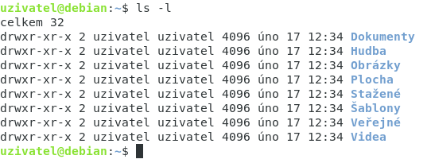

# Základní příkazy

Příkazy:
* **ls** -> Výpis adresářů
    * **-l** -> Podrobnější výpis
    * **-a** -> Zobrazí i skryté soubory
* **su** -> super user, přihlášení jako *root*
* **sudo** -> Provede příkaz jako *root*

&nbsp;

# Uživatelská práva

Práva uživatelů a skupin jsou vypsané ve výpisu adresářů -> *ls -l*

Např.:
>drwxr-x--x

* **d** -> directory
* **r** -> read
* **w** -> write
* **x** -> execute

Rozdělením získáme trojice:

>d/rwx/r-x/--x

První trojice -> uživatel

Druhá trojice -> skupina

Třetí trojice -> ostatní

## Změna práv

Příkazy:

* **chmod** -> Příkaz pro změnu práv souboru
    * **-r** -> změní práva na všech souborech rekurzivně

K příkazu *chmod* je potřeba přidat binární hodnota práv a soubor

Např.:
>chmod 750 soubor.txt

U čísla 7/5/0 platí stejné trojice jako u výpisu práv:
>750 -> drwxr-x---

&nbsp;

# Přidání uživatele

Přidat uživatele můžeme pomocí GUI nebo příkazu

Příkazy:
* **sudo adduser / useradd** -> Vytvoří nového uživatele
    * **-m** -> Vytvoří novému uživateli domovský adresář
* **passwd** -> změní nebo nastaví uživateli heslo

Např.:
>sudo adduser uzivatel -m

>passwd uzivatel